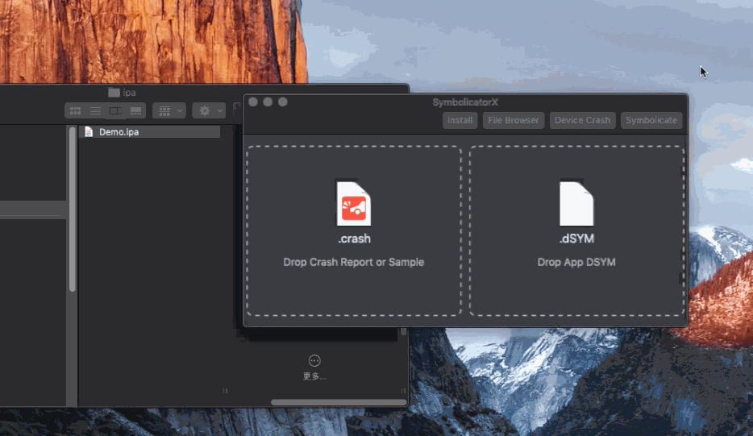

# SymbolicatorX
   

  

iOS/Mac 项目崩溃文件自动符号化工具.

[下载最新版本](https://github.com/Yueoaix/SymbolicatorX/releases)

## 主要功能
1. Crash 文件自动查找匹配的 dSYM 文件并解析
2. iOS 设备日志直接浏览,崩溃日志导入
3. App 沙盒内文件浏览与导出
4. ipa 包安装

## 使用方法
Crash 文件符号化,自动定位崩溃位置

设备崩溃日志直接导入使用

App 沙盒内文件浏览与导出

ipa 包安装

